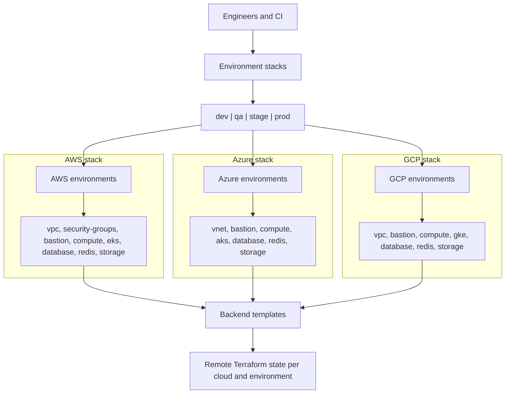
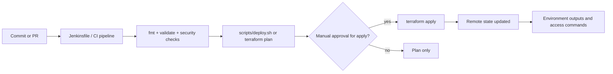
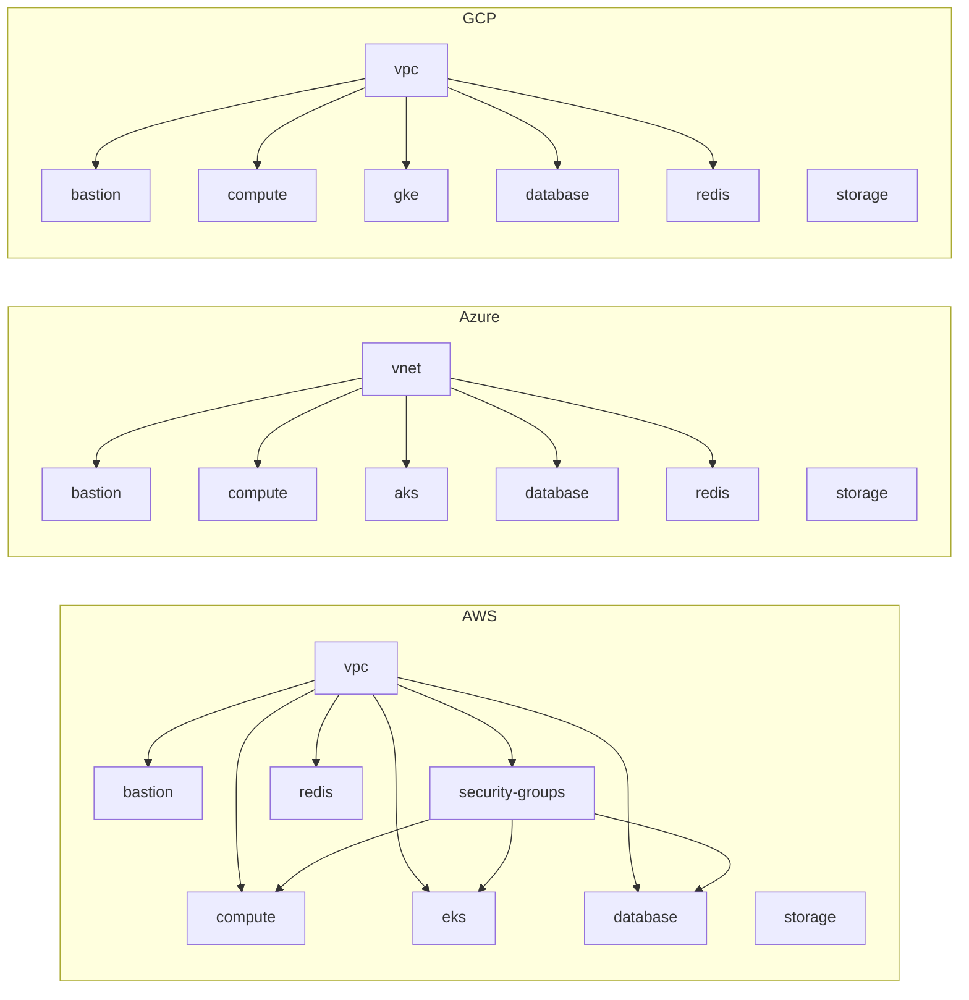
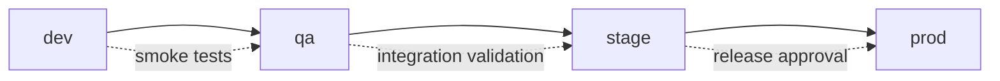
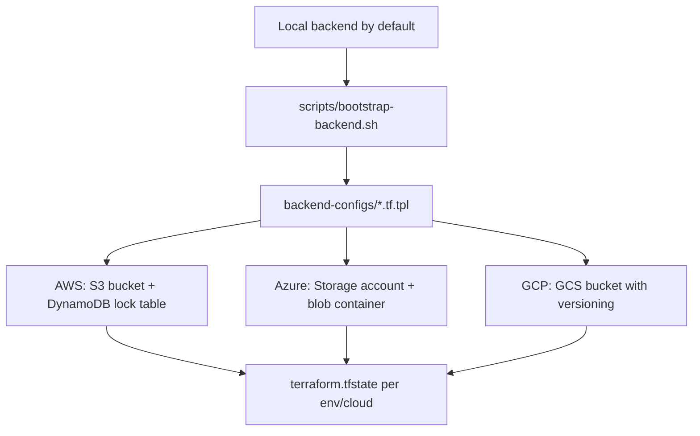
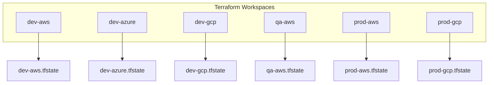

<div align="center">
<pre>
┌──────────────────────────────────────────────┐
│                                              │
│      SHASI-TERRAFORM-MULTICLOUD              │
│      Multi-Cloud Infrastructure as Code      │
│                                              │
│   ┌─────┐   ┌─────┐   ┌─────┐               │
│   │ AWS │   │Azure│   │ GCP │               │
│   └──┬──┘   └──┬──┘   └──┬──┘               │
│      └─────────┼─────────┘                   │
│           ┌────┴────┐                        │
│           │Terraform│                        │
│           └─────────┘                        │
│                                              │
│   Production-Grade Multi-Cloud IaC           │
│                                              │
└──────────────────────────────────────────────┘
</pre>
</div>

# 🌍 Terraform Multi-Cloud Infrastructure

## Overview
Terraform scaffolding for AWS, Azure, and GCP across `dev`, `qa`, `stage`, and `prod`. Each stack can deploy VMs, Kubernetes, databases, storage, networking, and optional bastion access using reusable modules.

## Architecture

### Overall Architecture


### Deployment Flow


### Module Dependency Graph


### Environment Promotion Flow


### Backend State Management


## Prerequisites
- Terraform >= 1.5.0: https://developer.hashicorp.com/terraform/downloads
- AWS CLI: `aws configure`
- Azure CLI: `az login`
- Google Cloud SDK: `gcloud auth application-default login`
- Optional remote-state tools: `gsutil`, `make`, `git`

### Authentication setup
```bash
# AWS
aws configure

# Azure
az login

# GCP
gcloud auth application-default login
gcloud config set project <PROJECT_ID>
```

## Quick Start
```bash
cd ~/terraform-multicloud
terraform fmt -recursive
make deploy
```

## Project Structure
```text
terraform-multicloud/
├── backend-configs/
│   ├── aws-backend.tf.tpl
│   ├── azure-backend.tf.tpl
│   └── gcp-backend.tf.tpl
├── environments/
│   ├── dev|qa|stage|prod/
│   │   ├── aws/    # env-specific AWS stack
│   │   ├── azure/  # env-specific Azure stack
│   │   └── gcp/    # env-specific GCP stack
├── logs/           # created at runtime by helper scripts (optional)
├── modules/
│   ├── aws/
│   │   ├── bastion/
│   │   ├── compute/
│   │   ├── database/
│   │   ├── eks/
│   │   ├── redis/
│   │   ├── security-groups/
│   │   ├── storage/
│   │   └── vpc/
│   ├── azure/
│   │   ├── aks/
│   │   ├── bastion/
│   │   ├── compute/
│   │   ├── database/
│   │   ├── redis/
│   │   ├── storage/
│   │   └── vnet/
│   └── gcp/
│       ├── bastion/
│       ├── compute/
│       ├── database/
│       ├── gke/
│       ├── redis/
│       ├── storage/
│       └── vpc/
├── scripts/
│   ├── bootstrap-backend.sh
│   ├── bump-version.sh
│   ├── ci-check.sh
│   ├── deploy.sh
│   ├── destroy.sh
│   └── validate.sh
├── versions/
│   ├── CHANGELOG.md
│   └── VERSION
├── Jenkinsfile
├── Makefile
├── sonar-project.properties
└── README.md
```

## Module Documentation
| Cloud | Modules |
|---|---|
| AWS | [bastion](modules/aws/bastion/README.md), [compute](modules/aws/compute/README.md), [database](modules/aws/database/README.md), [eks](modules/aws/eks/README.md), [redis](modules/aws/redis/README.md), [security-groups](modules/aws/security-groups/README.md), [storage](modules/aws/storage/README.md), [vpc](modules/aws/vpc/README.md) |
| Azure | [aks](modules/azure/aks/README.md), [bastion](modules/azure/bastion/README.md), [compute](modules/azure/compute/README.md), [database](modules/azure/database/README.md), [redis](modules/azure/redis/README.md), [storage](modules/azure/storage/README.md), [vnet](modules/azure/vnet/README.md) |
| GCP | [bastion](modules/gcp/bastion/README.md), [compute](modules/gcp/compute/README.md), [database](modules/gcp/database/README.md), [gke](modules/gcp/gke/README.md), [redis](modules/gcp/redis/README.md), [storage](modules/gcp/storage/README.md), [vpc](modules/gcp/vpc/README.md) |

## Environment Defaults
| env | clouds | vm_count | instance_size | db_class | multi_az | k8s_nodes |
|---|---|---:|---|---|---|---:|
| dev | aws / azure / gcp | 1 | t3.micro / Standard_B1s / e2-micro | db.t3.micro / Burstable / db-custom-1-3840 | no | 2 |
| qa | aws / azure / gcp | 2 | t3.small / Standard_B2s / e2-small | db.t3.micro / Burstable / db-custom-1-3840 | no | 2 |
| stage | aws / azure / gcp | 3 | t3.medium / Standard_B2ms / e2-medium | db.t3.small / General Purpose / db-custom-2-7680 | yes | 2 |
| prod | aws / azure / gcp | 5 | t3.large / Standard_D4s_v5 / e2-standard-2 | db.t3.medium / General Purpose / db-custom-4-15360 | yes | 2 |

## Terraform Workspaces

The deploy and destroy scripts use **Terraform workspaces** to isolate state per environment and cloud combination. Each `env/cloud` pair gets its own workspace (e.g., `dev-aws`, `prod-gcp`), so resources never collide across environments.

### Workspace Architecture


### How It Works
1. When you run `make deploy` or `./scripts/deploy.sh`, the script automatically creates or selects the workspace named `<env>-<cloud>` (e.g., `dev-aws`).
2. Each workspace maintains its own independent state file — dev resources are fully isolated from prod.
3. The destroy script selects the matching workspace before tearing down resources.
4. `terraform.workspace` is available in `.tf` files for dynamic naming (e.g., tagging resources with the workspace name).

### Step-by-Step: Working with Workspaces

#### Using the Interactive Script (Recommended)
```bash
# The script handles workspace creation/selection automatically
make deploy
# Select environment: dev → Select cloud: aws → workspace "dev-aws" is created/selected
```

#### Manual Workspace Workflow
```bash
# Step 1: Navigate to environment directory
cd environments/dev/aws

# Step 2: Initialize Terraform
terraform init

# Step 3: Create a workspace (first time only)
terraform workspace new dev-aws

# Step 4: Select the workspace (subsequent runs)
terraform workspace select dev-aws

# Step 5: Plan and apply
terraform plan -var="vm_count=2" -var="compute_type=vm"
terraform apply -var="vm_count=2" -var="compute_type=vm"

# Step 6: Verify active workspace
terraform workspace show
# Output: dev-aws

# Step 7: List all workspaces
terraform workspace list
# Output:
#   default
# * dev-aws
#   prod-aws
#   dev-gcp
```

#### Switching Between Environments
```bash
# Deploy to dev
cd environments/dev/aws
terraform workspace select dev-aws
terraform apply -var="vm_count=1" -var="compute_type=vm"

# Switch to prod (same directory structure, different workspace)
cd environments/prod/aws
terraform workspace select prod-aws
terraform apply -var="vm_count=5" -var="compute_type=vm"

# Check what's deployed in each
terraform workspace select dev-aws && terraform state list
terraform workspace select prod-aws && terraform state list
```

#### Destroying a Specific Workspace
```bash
cd environments/dev/aws
terraform workspace select dev-aws
terraform destroy -auto-approve

# Optionally delete the workspace after destroy
terraform workspace select default
terraform workspace delete dev-aws
```

### Workspace Naming Convention
| Environment | Cloud | Workspace Name |
|---|---|---|
| dev | AWS | `dev-aws` |
| dev | Azure | `dev-azure` |
| dev | GCP | `dev-gcp` |
| qa | AWS | `qa-aws` |
| qa | Azure | `qa-azure` |
| qa | GCP | `qa-gcp` |
| stage | AWS | `stage-aws` |
| stage | Azure | `stage-azure` |
| stage | GCP | `stage-gcp` |
| prod | AWS | `prod-aws` |
| prod | Azure | `prod-azure` |
| prod | GCP | `prod-gcp` |

### Best Practices
- **Never deploy to `default` workspace** — always use environment-specific workspaces
- **Use remote backends** (S3, GCS, Azure Blob) with workspaces for team collaboration — each workspace gets a separate state key
- **Reference `terraform.workspace`** in resource tags for traceability:
  ```hcl
  locals {
    common_tags = {
      environment = terraform.workspace
      managed_by  = "terraform"
    }
  }
  ```
- **List workspaces** before deploying to verify you're targeting the right environment

## Deployment Guide

### Option A: Interactive Deploy (Recommended)
```bash
make deploy
# or
./scripts/deploy.sh
```
Prompts cover environment selection, cloud selection, compute mode (VMs / Kubernetes / Both), database engine, VM scaling (1-50), Kubernetes node count (1-50), and action (`plan`, `apply`, or `destroy`).

### Option B: Manual Per-Environment Deploy
```bash
./scripts/bootstrap-backend.sh
cd environments/dev/aws
terraform init
terraform plan -var="vm_count=2" -var="compute_type=vm" -var="db_engine=postgresql"
terraform apply -var="vm_count=2" -var="compute_type=vm" -var="db_engine=postgresql"
```

### Option C: Kubernetes Deployment (EKS/GKE/AKS)
```bash
cd environments/dev/aws
terraform apply -var="compute_type=kubernetes" -var="node_count=3"
aws eks update-kubeconfig --region us-east-1 --name terraform-multicloud-dev-eks
```

### Option D: Deploy Only Specific Cloud
```bash
./scripts/deploy.sh
# choose one cloud interactively

cd environments/prod/gcp
terraform apply
```

## Resources Created Per Cloud

### AWS
| Resource | Module | Variable |
|---|---|---|
| VPC + subnets + NACLs | [`vpc`](modules/aws/vpc/README.md) | `vpc_cidr` |
| Security groups | [`security-groups`](modules/aws/security-groups/README.md) | - |
| Bastion host | [`bastion`](modules/aws/bastion/README.md) | `create_bastion=true` |
| EC2 instances | [`compute`](modules/aws/compute/README.md) | `vm_count` (1-50) |
| EKS cluster | [`eks`](modules/aws/eks/README.md) | `node_count` (1-50) |
| RDS / Aurora | [`database`](modules/aws/database/README.md) | `db_engine` |
| ElastiCache Redis | [`redis`](modules/aws/redis/README.md) | `enable_redis=true` |
| S3 bucket | [`storage`](modules/aws/storage/README.md) | `bucket_name_suffix` |

### Azure
| Resource | Module | Variable |
|---|---|---|
| VNet + subnets + route table | [`vnet`](modules/azure/vnet/README.md) | `vnet_cidr` |
| Bastion VM | [`bastion`](modules/azure/bastion/README.md) | `create_bastion=true` |
| Linux / Windows VMs | [`compute`](modules/azure/compute/README.md) | `vm_count` (1-50) |
| AKS cluster | [`aks`](modules/azure/aks/README.md) | `node_count` (1-50) |
| PostgreSQL / MySQL / Azure SQL | [`database`](modules/azure/database/README.md) | `db_engine` |
| Azure Cache for Redis | [`redis`](modules/azure/redis/README.md) | `enable_redis=true` |
| Storage account + container | [`storage`](modules/azure/storage/README.md) | `account_tier` |

### GCP
| Resource | Module | Variable |
|---|---|---|
| VPC + subnets + firewalls + NAT | [`vpc`](modules/gcp/vpc/README.md) | `vpc_cidr` |
| Bastion VM | [`bastion`](modules/gcp/bastion/README.md) | `create_bastion=true` |
| Compute Engine VMs | [`compute`](modules/gcp/compute/README.md) | `vm_count` (1-50) |
| GKE cluster | [`gke`](modules/gcp/gke/README.md) | `node_count` (1-50) |
| Cloud SQL | [`database`](modules/gcp/database/README.md) | `db_engine` |
| Memorystore for Redis | [`redis`](modules/gcp/redis/README.md) | `enable_redis=true` |
| GCS bucket | [`storage`](modules/gcp/storage/README.md) | `bucket_name_suffix` |

## Database Engine Selection
| Cloud | Engines |
|---|---|
| AWS | PostgreSQL, MySQL, SQL Server, Aurora PostgreSQL, Aurora MySQL |
| Azure | PostgreSQL Flexible, MySQL Flexible, Azure SQL |
| GCP | PostgreSQL, MySQL, SQL Server |

## VM / Node Count Scaling
- VMs: set `vm_count` in tfvars or pass `-var="vm_count=25"` (max 50)
- Kubernetes: set `node_count` (max 50)
- Autoscaling knobs: `node_min_count`, `node_max_count`, `enable_auto_scaling`

## SSH Access
When `create_bastion=true`, Terraform provisions a public bastion per cloud.

```bash
# AWS output example
terraform output bastion_ssh_command

# Azure output example
ssh azureadmin@<bastion_public_ip>

# GCP output example
ssh debian@<bastion_public_ip>
```

## State Backend Setup
1. **Local state (default)**: every `backend.tf` starts with a local backend.
2. **Remote state with locking**: run `./scripts/bootstrap-backend.sh`.
3. **Manual backend config**: copy a template from `backend-configs/`, replace values, then run:
```bash
terraform init -migrate-state
```

## State Versioning
- AWS S3 backend bootstrap enables bucket versioning and SSE.
- Azure bootstrap stores state in a blob container inside a dedicated storage account.
- GCP bootstrap enables bucket versioning for rollback-friendly state history.

## Version Control & Tagging
```bash
git tag -a v1.1.0 -m "Added EKS support"
make tag version=v1.2.0
```

## Variable Reference
### Common environment variables
| Variable | Purpose |
|---|---|
| `compute_type` | `vm` or `kubernetes` primary deployment mode |
| `use_kubernetes` | deploy Kubernetes in addition to `compute_type=vm` |
| `create_bastion` | toggles bastion host creation |
| `db_engine` | selects the database engine per cloud |
| `vm_count` | VM count, validated from 1 to 50 |
| `node_count` | Kubernetes node count, validated from 1 to 50 |
| `ssh_allowed_cidrs` | SSH ingress CIDRs for bastion resources |

### AWS-specific additions
`vm_public_key`, `bastion_public_key`, `node_instance_type`, `public_api_access`, `api_allowed_cidrs`

### Azure-specific additions
`bastion_public_key`, `kubernetes_public_key`, `node_vm_size`, `aks_admin_username`, `mysql_version`, `mssql_sku`

### GCP-specific additions
`bastion_public_key`, `node_machine_type`, `release_channel`, `cluster_ipv4_cidr`, `services_ipv4_cidr`, `master_ipv4_cidr_block`

## Makefile Targets
| Target | Description |
|---|---|
| `make deploy` | Run interactive deployment |
| `make destroy` | Run destroy helper |
| `make validate` | Execute validation script |
| `make fmt` | Run `terraform fmt -recursive` |
| `make docs` | Placeholder docs target |
| `make tag version=vX.Y.Z` | Create annotated tag |

## 📚 Official Documentation
- [Terraform Documentation](https://developer.hashicorp.com/terraform/docs)
- [Terraform Modules Language Reference](https://developer.hashicorp.com/terraform/language/modules)
- [AWS Provider Documentation](https://registry.terraform.io/providers/hashicorp/aws/latest/docs)
- [AzureRM Provider Documentation](https://registry.terraform.io/providers/hashicorp/azurerm/latest/docs)
- [Google Provider Documentation](https://registry.terraform.io/providers/hashicorp/google/latest/docs)
- [AWS Documentation](https://docs.aws.amazon.com/)
- [Azure Documentation](https://learn.microsoft.com/en-us/azure/)
- [Google Cloud Documentation](https://cloud.google.com/docs)

## Troubleshooting
- **Aurora selected with non-AWS clouds**: use AWS only, or switch to PostgreSQL/MySQL.
- **AKS / bastion SSH key errors**: set `bastion_public_key` and/or `kubernetes_public_key` in tfvars or CLI overrides.
- **Cloud SQL private networking errors**: ensure the selected project and VPC allow private service access.
- **Remote backend auth failures**: verify `aws`, `az`, or `gcloud/gsutil` authentication before running `bootstrap-backend.sh`.
- **Large deployments**: scale `vm_count` and `node_count` gradually and use `terraform plan` first.
