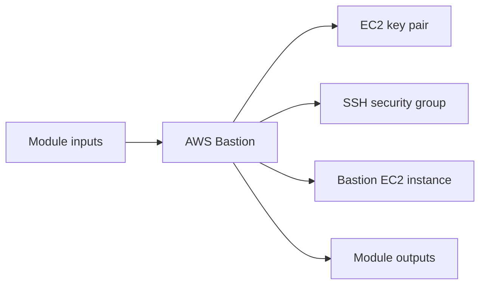

# AWS Bastion Module

Creates a public bastion EC2 instance with its own security group and key pair for administrative SSH access.

## Architecture


## Usage
```hcl
module "bastion" {
  source = "../../../modules/aws/bastion"
  project                  = "terraform-multicloud"
  environment              = "dev"
  vpc_id                   = "vpc-0123456789abcdef0"
  public_subnet_id         = "subnet-0123456789abcdef0"
  public_key               = file("~/.ssh/id_rsa.pub")
  tags                     = { ManagedBy = "terraform" }
}
```

## Inputs
| Name | Description | Type | Default | Required |
|---|---|---|---|---|
| `project` | Project name. | `string` | n/a | yes |
| `environment` | Deployment environment. | `string` | n/a | yes |
| `vpc_id` | VPC identifier. | `string` | n/a | yes |
| `public_subnet_id` | Public subnet identifier for the bastion host. | `string` | n/a | yes |
| `public_key` | SSH public key for bastion access. | `string` | n/a | yes |
| `allowed_ssh_cidrs` | CIDR blocks allowed to SSH to the bastion host. | `list(string)` | `["0.0.0.0/0"]` | no |
| `ami_id` | Optional AMI override for the bastion host. | `string` | `null` | no |
| `tags` | Common resource tags. | `map(string)` | `{}` | no |

## Outputs
| Name | Description |
|---|---|
| `bastion_public_ip` | Bastion Public IP exposed by the module. |
| `bastion_instance_id` | Bastion Instance ID exposed by the module. |
| `bastion_key_name` | Bastion Key Name exposed by the module. |
| `bastion_security_group_id` | Bastion Security Group ID exposed by the module. |
| `ssh_command` | SSH Command exposed by the module. |

## Dependencies/Requirements
- Terraform `>= 1.5.0`
- Provider `aws` ~> 5.0
- Requires VPC and public subnet outputs from `modules/aws/vpc`.
- Requires an SSH public key for bastion access.
