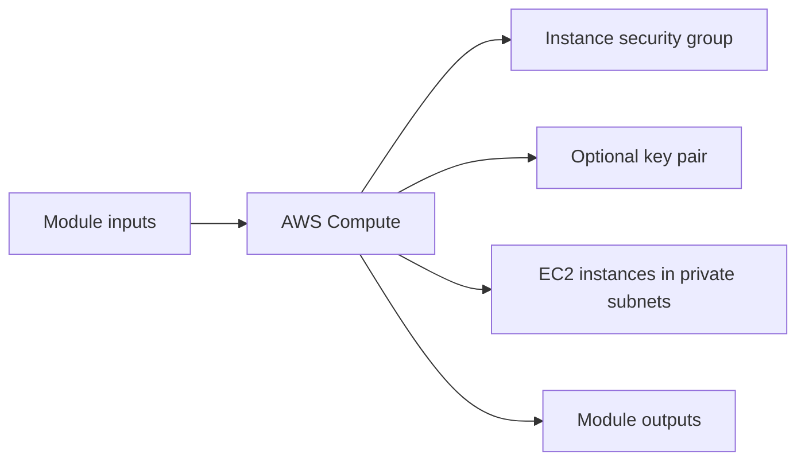

# AWS Compute Module

Deploys EC2 instances across private subnets with a dedicated security group and optional key pair registration.

## Architecture


## Usage
```hcl
module "compute" {
  source = "../../../modules/aws/compute"
  project                  = "terraform-multicloud"
  environment              = "dev"
  vpc_id                   = "vpc-0123456789abcdef0"
  private_subnet_ids       = ["subnet-0123456789abcdef0", "subnet-abcdef01234567890"]
  instance_type            = "t3.micro"
  tags                     = { ManagedBy = "terraform" }
}
```

## Inputs
| Name | Description | Type | Default | Required |
|---|---|---|---|---|
| `project` | Project name. | `string` | n/a | yes |
| `environment` | Deployment environment. | `string` | n/a | yes |
| `vpc_id` | VPC identifier. | `string` | n/a | yes |
| `private_subnet_ids` | Private subnet identifiers. | `list(string)` | n/a | yes |
| `vm_count` | Number of virtual machines to create. | `number` | `2` | no |
| `instance_type` | EC2 instance type. | `string` | n/a | yes |
| `ami_id` | Optional AMI ID override. | `string` | `null` | no |
| `image_os` | AMI OS selection. | `string` | `"amazon-linux"` | no |
| `key_name` | Optional existing key pair name. | `string` | `null` | no |
| `public_key` | Optional public key content used when creating a key pair. | `string` | `null` | no |
| `additional_security_group_ids` | Additional security group identifiers to attach to compute instances. | `list(string)` | `[]` | no |
| `tags` | Common resource tags. | `map(string)` | `{}` | no |

## Outputs
| Name | Description |
|---|---|
| `instance_ids` | EC2 instance identifiers. |
| `private_ips` | Private IP addresses of the instances. |
| `security_group_id` | Security group identifier. |

## Dependencies/Requirements
- Terraform `>= 1.5.0`
- Provider `aws` ~> 5.0
- Requires VPC and private subnet outputs from `modules/aws/vpc`.
- Can be paired with `modules/aws/security-groups` for additional ingress rules.
