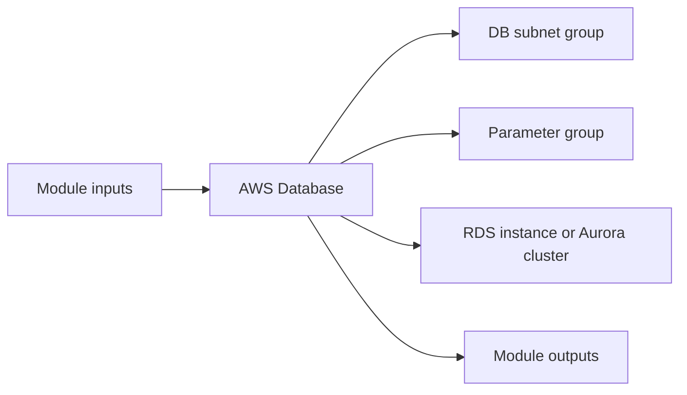

# AWS Database Module

Deploys either a single Amazon RDS instance or an Aurora cluster inside database subnets.

## Architecture


## Usage
```hcl
module "database" {
  source = "../../../modules/aws/database"
  project                  = "terraform-multicloud"
  environment              = "dev"
  vpc_id                   = "vpc-0123456789abcdef0"
  db_subnet_ids            = ["subnet-11111111111111111", "subnet-22222222222222222"]
  db_name                  = "appdb"
  db_username              = "appadmin"
  db_password              = "change-me-securely"
  instance_class           = "db.t3.micro"
  multi_az                 = true
  db_security_group_id     = "sg-0123456789abcdef0"
  tags                     = { ManagedBy = "terraform" }
}
```

## Inputs
| Name | Description | Type | Default | Required |
|---|---|---|---|---|
| `project` | Project name. | `string` | n/a | yes |
| `environment` | Deployment environment. | `string` | n/a | yes |
| `vpc_id` | VPC identifier. | `string` | n/a | yes |
| `db_subnet_ids` | Database subnet identifiers. | `list(string)` | n/a | yes |
| `engine` | Database engine: postgresql, mysql, sqlserver-se, aurora-postgresql, aurora-mysql | `string` | `"postgresql"` | no |
| `db_name` | Database name. | `string` | n/a | yes |
| `db_username` | Database administrator username. | `string` | n/a | yes |
| `db_password` | Database administrator password. | `string` | n/a | yes |
| `instance_class` | RDS instance class. | `string` | n/a | yes |
| `engine_version` | Optional database engine version override. | `string` | `null` | no |
| `allocated_storage` | Allocated storage in GB. | `number` | `20` | no |
| `multi_az` | Enable Multi-AZ deployment. | `bool` | n/a | yes |
| `db_security_group_id` | Security group ID for the database. | `string` | n/a | yes |
| `tags` | Common resource tags. | `map(string)` | `{}` | no |

## Outputs
| Name | Description |
|---|---|
| `db_endpoint` | DB Endpoint exposed by the module. |
| `db_reader_endpoint` | DB Reader Endpoint exposed by the module. |
| `db_port` | DB Port exposed by the module. |
| `db_name` | DB Name exposed by the module. |
| `engine` | Engine exposed by the module. |

## Dependencies/Requirements
- Terraform `>= 1.5.0`
- Provider `aws` ~> 5.0
- Requires database subnet outputs from `modules/aws/vpc`.
- Requires a database security group, commonly from `modules/aws/security-groups`.
- Provide credentials securely via tfvars, environment variables, or a secret manager.
