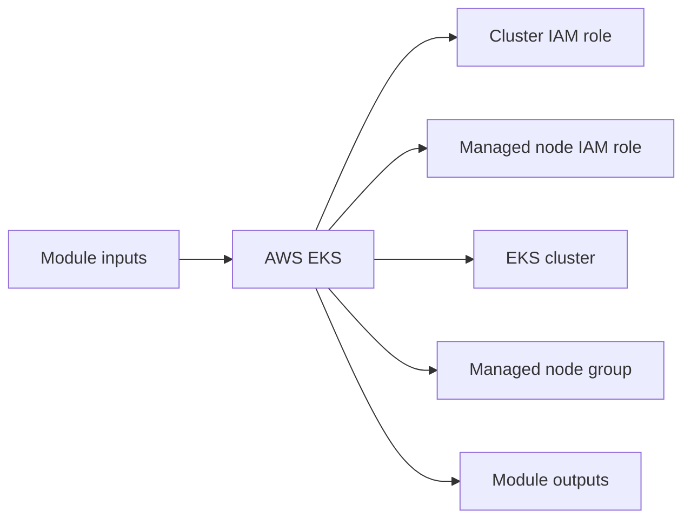

# AWS EKS Module

Creates an Amazon EKS control plane and managed node group with the required IAM roles and policy attachments.

## Architecture


## Usage
```hcl
module "eks" {
  source = "../../../modules/aws/eks"
  project                  = "terraform-multicloud"
  environment              = "dev"
  private_subnet_ids       = ["subnet-0123456789abcdef0", "subnet-abcdef01234567890"]
  public_subnet_ids        = ["subnet-11111111111111111", "subnet-22222222222222222"]
  tags                     = { ManagedBy = "terraform" }
}
```

## Inputs
| Name | Description | Type | Default | Required |
|---|---|---|---|---|
| `project` | Project name. | `string` | n/a | yes |
| `environment` | Deployment environment. | `string` | n/a | yes |
| `private_subnet_ids` | Private subnet identifiers for worker nodes. | `list(string)` | n/a | yes |
| `public_subnet_ids` | Public subnet identifiers for control plane access and load balancers. | `list(string)` | n/a | yes |
| `kubernetes_version` | EKS Kubernetes version. | `string` | `"1.29"` | no |
| `node_instance_type` | EKS node instance type. | `string` | `"t3.medium"` | no |
| `node_count` | Desired node count. | `number` | `2` | no |
| `node_min_count` | Minimum node count. | `number` | `1` | no |
| `node_max_count` | Maximum node count. | `number` | `10` | no |
| `node_disk_size` | Worker node disk size in GB. | `number` | `50` | no |
| `public_api_access` | Expose the EKS API publicly. | `bool` | `true` | no |
| `api_allowed_cidrs` | Allowed CIDRs for public EKS API access. | `list(string)` | `["0.0.0.0/0"]` | no |
| `additional_security_group_ids` | Additional cluster security groups. | `list(string)` | `[]` | no |
| `tags` | Common resource tags. | `map(string)` | `{}` | no |

## Outputs
| Name | Description |
|---|---|
| `cluster_name` | Cluster Name exposed by the module. |
| `cluster_endpoint` | Cluster Endpoint exposed by the module. |
| `cluster_ca_certificate` | Cluster CA Certificate exposed by the module. |
| `cluster_arn` | Cluster ARN exposed by the module. |
| `node_group_arn` | Node Group ARN exposed by the module. |
| `kubeconfig_command` | Kubeconfig Command exposed by the module. |

## Dependencies/Requirements
- Terraform `>= 1.5.0`
- Provider `aws` ~> 5.0
- Requires public and private subnet outputs from `modules/aws/vpc`.
- Commonly consumes worker security groups from `modules/aws/security-groups`.
