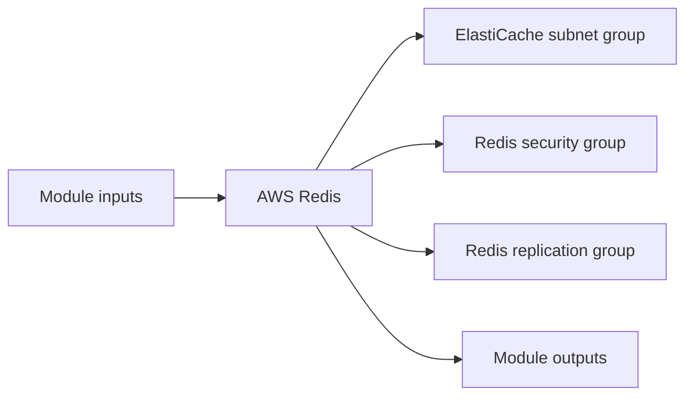

# AWS Redis Module

Creates an ElastiCache Redis replication group with a subnet group and tightly scoped security group.

## Architecture


## Usage
```hcl
module "redis" {
  source = "../../../modules/aws/redis"
  project                  = "terraform-multicloud"
  environment              = "dev"
  vpc_id                   = "vpc-0123456789abcdef0"
  private_subnet_ids       = ["subnet-0123456789abcdef0", "subnet-abcdef01234567890"]
  tags                     = { ManagedBy = "terraform" }
}
```

## Inputs
| Name | Description | Type | Default | Required |
|---|---|---|---|---|
| `project` | Project. | `string` | n/a | yes |
| `environment` | Environment. | `string` | n/a | yes |
| `vpc_id` | VPC ID. | `string` | n/a | yes |
| `private_subnet_ids` | Private Subnet IDs. | `list(string)` | n/a | yes |
| `node_type` | ElastiCache node type. | `string` | `"cache.t3.micro"` | no |
| `engine_version` | Redis engine version. | `string` | `"7.0"` | no |
| `allowed_cidr_blocks` | CIDRs allowed to connect to Redis. | `list(string)` | `["10.0.0.0/8"]` | no |
| `tags` | Tags. | `map(string)` | `{}` | no |

## Outputs
| Name | Description |
|---|---|
| `redis_endpoint` | Redis primary endpoint. |
| `redis_reader_endpoint` | Redis reader endpoint. |
| `redis_port` | Redis Port exposed by the module. |
| `redis_security_group_id` | Redis Security Group ID exposed by the module. |

## Dependencies/Requirements
- Terraform `>= 1.5.0`
- Provider `aws` ~> 5.0
- Requires VPC and private subnet outputs from `modules/aws/vpc`.
- Ingress CIDRs should allow only trusted application networks.
