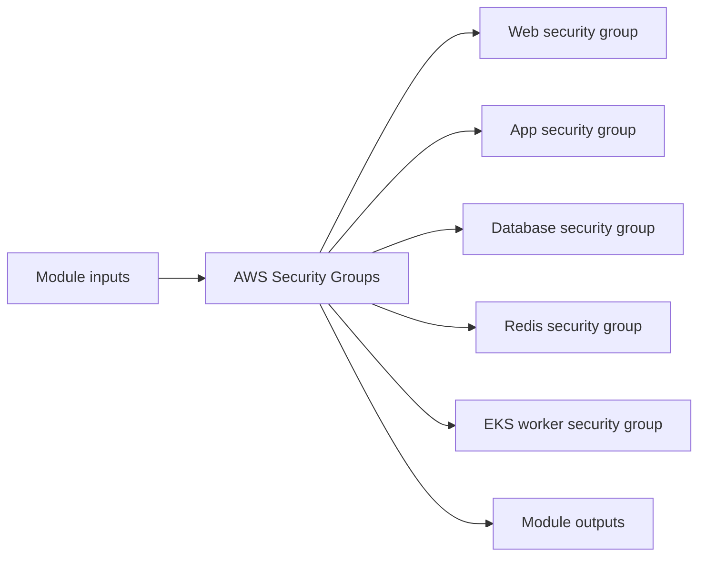

# AWS Security Groups Module

Defines layered security groups for web, app, database, Redis, and EKS worker tiers inside a VPC.

## Architecture


## Usage
```hcl
module "security_groups" {
  source = "../../../modules/aws/security-groups"
  project                  = "terraform-multicloud"
  environment              = "dev"
  vpc_id                   = "vpc-0123456789abcdef0"
  tags                     = { ManagedBy = "terraform" }
}
```

## Inputs
| Name | Description | Type | Default | Required |
|---|---|---|---|---|
| `project` | Project name. | `string` | n/a | yes |
| `environment` | Deployment environment. | `string` | n/a | yes |
| `vpc_id` | VPC identifier. | `string` | n/a | yes |
| `bastion_sg_id` | Bastion security group identifier. Leave empty to skip bastion SSH ingress rules. | `string` | `""` | no |
| `tags` | Common resource tags. | `map(string)` | `{}` | no |

## Outputs
| Name | Description |
|---|---|
| `web_sg_id` | Web Sg ID exposed by the module. |
| `app_sg_id` | App Sg ID exposed by the module. |
| `db_sg_id` | DB Sg ID exposed by the module. |
| `redis_sg_id` | Redis security group ID. |
| `eks_workers_sg_id` | EKS Workers Sg ID exposed by the module. |

## Dependencies/Requirements
- Terraform `>= 1.5.0`
- Provider `aws` ~> 5.0
- Requires the VPC ID from `modules/aws/vpc`.
- Optionally references the bastion security group from `modules/aws/bastion`.
