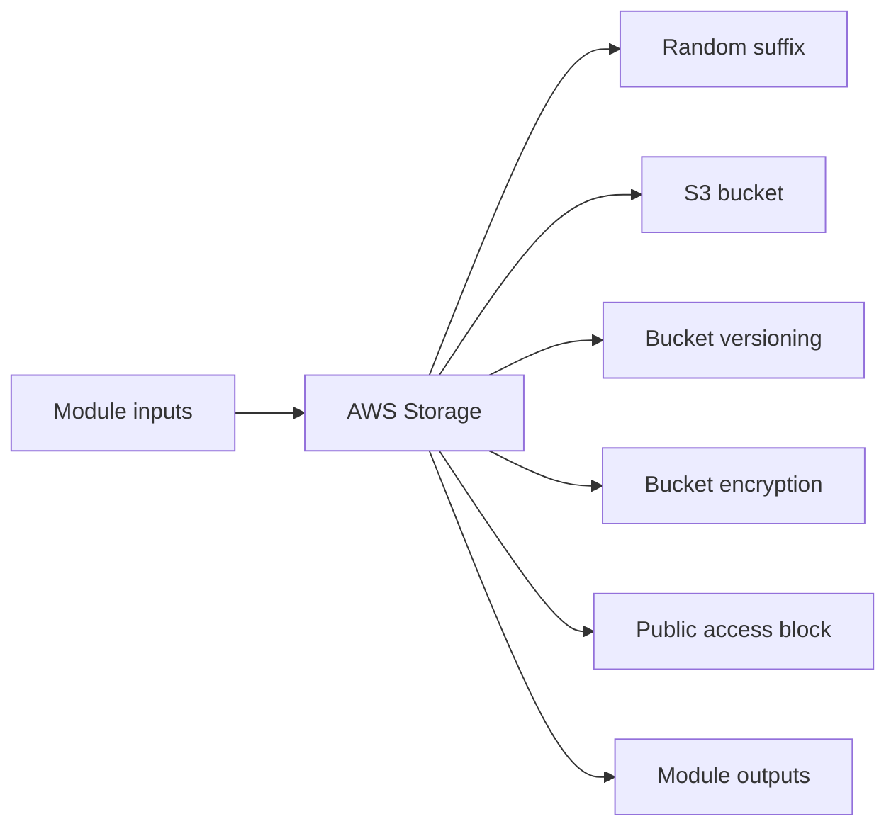

# AWS Storage Module

Creates an S3 bucket with a unique suffix, versioning, server-side encryption, and public access blocking.

## Architecture


## Usage
```hcl
module "storage" {
  source = "../../../modules/aws/storage"
  project                  = "terraform-multicloud"
  environment              = "dev"
  bucket_name_suffix       = "shared"
  tags                     = { ManagedBy = "terraform" }
}
```

## Inputs
| Name | Description | Type | Default | Required |
|---|---|---|---|---|
| `project` | Project name. | `string` | n/a | yes |
| `environment` | Deployment environment. | `string` | n/a | yes |
| `bucket_name_suffix` | Suffix used in the S3 bucket name. | `string` | n/a | yes |
| `tags` | Common resource tags. | `map(string)` | `{}` | no |

## Outputs
| Name | Description |
|---|---|
| `bucket_id` | S3 bucket identifier. |
| `bucket_arn` | S3 bucket ARN. |
| `bucket_domain_name` | S3 bucket regional domain name. |

## Dependencies/Requirements
- Terraform `>= 1.5.0`
- Provider `aws` ~> 5.0
- Provider `random` ~> 3.6
- Bucket names must be globally unique.
- Suitable for artifacts, backups, and shared application storage.
