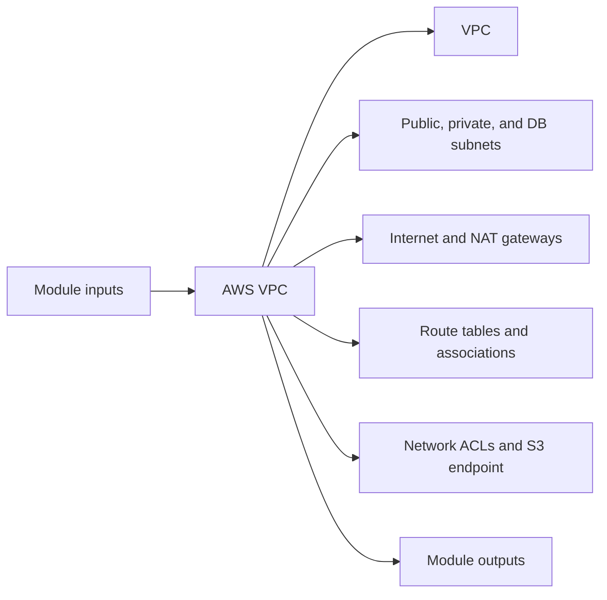

# AWS VPC Module

Builds the foundational AWS network with public, private, and database subnets plus routing, NAT, NACLs, and an S3 endpoint.

## Architecture


## Usage
```hcl
module "vpc" {
  source = "../../../modules/aws/vpc"
  project                  = "terraform-multicloud"
  environment              = "dev"
  region                   = "us-east-1"
  tags                     = { ManagedBy = "terraform" }
}
```

## Inputs
| Name | Description | Type | Default | Required |
|---|---|---|---|---|
| `project` | Project name. | `string` | n/a | yes |
| `environment` | Deployment environment. | `string` | n/a | yes |
| `vpc_cidr` | CIDR block for the VPC. | `string` | `"10.0.0.0/16"` | no |
| `region` | AWS region. | `string` | n/a | yes |
| `tags` | Common resource tags. | `map(string)` | `{}` | no |

## Outputs
| Name | Description |
|---|---|
| `vpc_id` | VPC identifier. |
| `public_subnet_ids` | Public subnet identifiers. |
| `private_subnet_ids` | Private subnet identifiers. |
| `db_subnet_ids` | Database subnet identifiers. |
| `vpc_cidr` | VPC CIDR block. |

## Dependencies/Requirements
- Terraform `>= 1.5.0`
- Provider `aws` ~> 5.0
- This is the base networking module for the AWS stack.
- Downstream AWS modules typically consume its subnet and VPC outputs.
