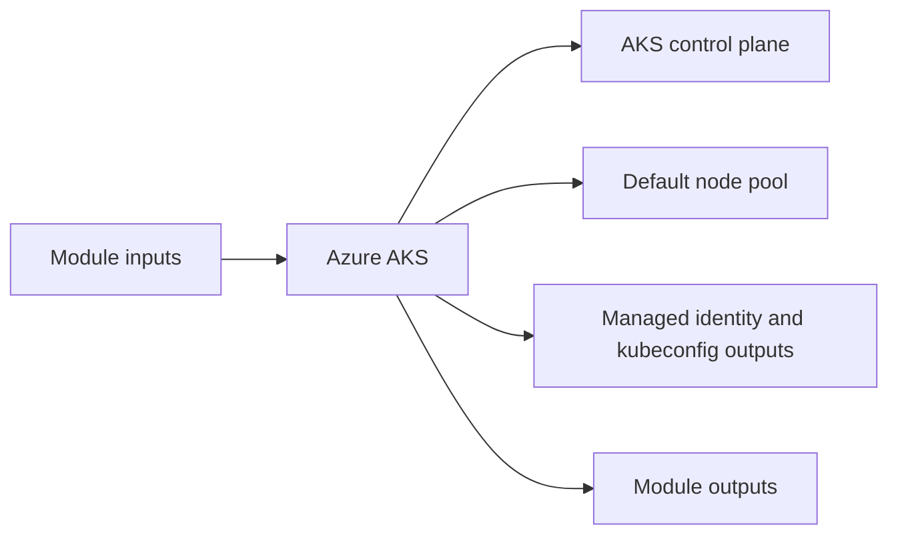

# Azure AKS Module

Deploys an AKS cluster with configurable node pools, autoscaling, and SSH access for Linux nodes.

## Architecture


## Usage
```hcl
module "aks" {
  source = "../../../modules/azure/aks"
  project                  = "terraform-multicloud"
  environment              = "dev"
  resource_group_name      = "rg-terraform-multicloud-dev"
  location                 = "eastus"
  subnet_id                = "/subscriptions/00000000-0000-0000-0000-000000000000/resourceGroups/rg-terraform-multicloud-dev/providers/Microsoft.Network/virtualNetworks/terraform-multicloud-dev-vnet/subnets/private"
  tags                     = { ManagedBy = "terraform" }
}
```

## Inputs
| Name | Description | Type | Default | Required |
|---|---|---|---|---|
| `project` | Project name. | `string` | n/a | yes |
| `environment` | Deployment environment. | `string` | n/a | yes |
| `resource_group_name` | Azure resource group name. | `string` | n/a | yes |
| `location` | Azure region. | `string` | n/a | yes |
| `subnet_id` | Subnet identifier used for AKS nodes. | `string` | n/a | yes |
| `kubernetes_version` | AKS Kubernetes version. | `string` | `"1.29.0"` | no |
| `node_vm_size` | AKS node VM size. | `string` | `"Standard_D2s_v3"` | no |
| `node_count` | Desired node count. | `number` | `2` | no |
| `node_min_count` | Minimum node count. | `number` | `1` | no |
| `node_max_count` | Maximum node count. | `number` | `10` | no |
| `node_disk_size` | AKS node disk size in GB. | `number` | `50` | no |
| `enable_auto_scaling` | Enable autoscaling for AKS nodes. | `bool` | `true` | no |
| `admin_username` | AKS Linux admin username. | `string` | `"azureuser"` | no |
| `public_key` | SSH public key for AKS node access. Leave empty to skip SSH configuration. | `string` | `""` | no |
| `tags` | Common resource tags. | `map(string)` | `{}` | no |

## Outputs
| Name | Description |
|---|---|
| `cluster_name` | Cluster Name exposed by the module. |
| `cluster_id` | Cluster ID exposed by the module. |
| `kube_config_raw` | Kube Config Raw exposed by the module. |
| `host` | Host exposed by the module. |
| `client_certificate` | Client Certificate exposed by the module. |
| `kubeconfig_command` | Kubeconfig Command exposed by the module. |

## Dependencies/Requirements
- Terraform `>= 1.5.0`
- Provider `azurerm` ~> 3.0
- Requires subnet and resource group outputs from `modules/azure/vnet`.
- Requires an SSH public key for Linux node access configuration.
