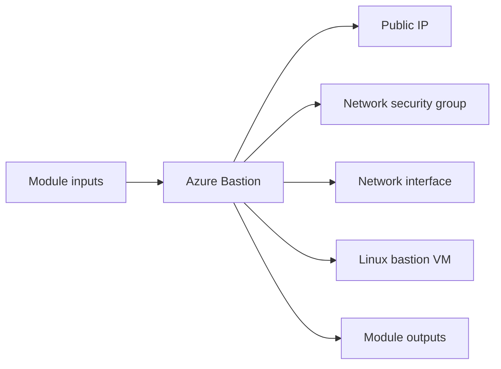

# Azure Bastion Module

Creates a bastion-style Azure Linux VM with a public IP, NIC, and NSG for controlled SSH administration.

## Architecture


## Usage
```hcl
module "bastion" {
  source = "../../../modules/azure/bastion"
  project                  = "terraform-multicloud"
  environment              = "dev"
  resource_group_name      = "rg-terraform-multicloud-dev"
  location                 = "eastus"
  subnet_id                = "/subscriptions/00000000-0000-0000-0000-000000000000/resourceGroups/rg-terraform-multicloud-dev/providers/Microsoft.Network/virtualNetworks/terraform-multicloud-dev-vnet/subnets/private"
  admin_username           = "azureadmin"
  public_key               = file("~/.ssh/id_rsa.pub")
  tags                     = { ManagedBy = "terraform" }
}
```

## Inputs
| Name | Description | Type | Default | Required |
|---|---|---|---|---|
| `project` | Project name. | `string` | n/a | yes |
| `environment` | Deployment environment. | `string` | n/a | yes |
| `resource_group_name` | Azure resource group name. | `string` | n/a | yes |
| `location` | Azure region. | `string` | n/a | yes |
| `subnet_id` | Public subnet identifier for the bastion host. | `string` | n/a | yes |
| `admin_username` | Administrator username for the bastion host. | `string` | n/a | yes |
| `public_key` | SSH public key for bastion access. | `string` | n/a | yes |
| `allowed_ssh_cidrs` | CIDR blocks allowed to SSH to the bastion host. | `list(string)` | `["0.0.0.0/0"]` | no |
| `tags` | Common resource tags. | `map(string)` | `{}` | no |

## Outputs
| Name | Description |
|---|---|
| `bastion_public_ip` | Bastion Public IP exposed by the module. |
| `vm_id` | VM ID exposed by the module. |
| `ssh_command` | SSH Command exposed by the module. |

## Dependencies/Requirements
- Terraform `>= 1.5.0`
- Provider `azurerm` ~> 3.0
- Requires subnet and resource group outputs from `modules/azure/vnet`.
- Requires an SSH public key for administrator access.
