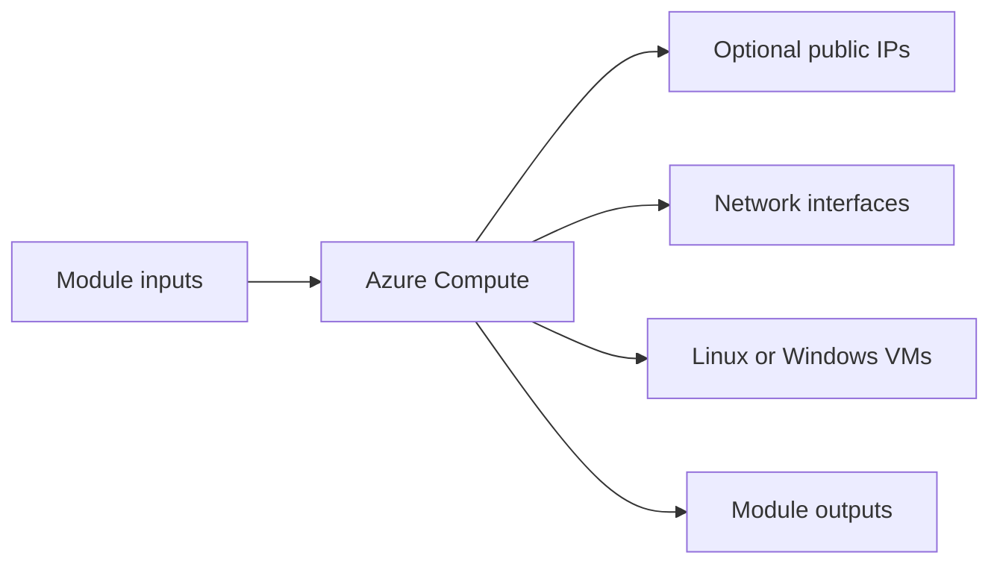

# Azure Compute Module

Creates Azure Linux or Windows virtual machines with optional public IPs and multiple NIC-backed instances.

## Architecture


## Usage
```hcl
module "compute" {
  source = "../../../modules/azure/compute"
  project                  = "terraform-multicloud"
  environment              = "dev"
  resource_group_name      = "rg-terraform-multicloud-dev"
  location                 = "eastus"
  subnet_id                = "/subscriptions/00000000-0000-0000-0000-000000000000/resourceGroups/rg-terraform-multicloud-dev/providers/Microsoft.Network/virtualNetworks/terraform-multicloud-dev-vnet/subnets/private"
  vm_size                  = "Standard_B2s"
  admin_username           = "azureadmin"
  admin_password           = "ChangeMe123!"
  tags                     = { ManagedBy = "terraform" }
}
```

## Inputs
| Name | Description | Type | Default | Required |
|---|---|---|---|---|
| `project` | Project name. | `string` | n/a | yes |
| `environment` | Deployment environment. | `string` | n/a | yes |
| `resource_group_name` | Azure resource group name. | `string` | n/a | yes |
| `location` | Azure region. | `string` | n/a | yes |
| `subnet_id` | Subnet identifier for the VMs. | `string` | n/a | yes |
| `vm_count` | Number of virtual machines to create. | `number` | `2` | no |
| `vm_size` | Azure VM size. | `string` | n/a | yes |
| `image_os` | Azure VM OS selection. | `string` | `"ubuntu"` | no |
| `admin_username` | Administrator username. | `string` | n/a | yes |
| `admin_password` | Administrator password. | `string` | n/a | yes |
| `os_disk_size_gb` | OS disk size in GB. | `number` | `30` | no |
| `assign_public_ip` | Assign a public IP to each VM. | `bool` | `false` | no |
| `tags` | Common resource tags. | `map(string)` | `{}` | no |

## Outputs
| Name | Description |
|---|---|
| `vm_ids` | Azure VM identifiers. |
| `private_ips` | Private IP addresses for the Azure VMs. |
| `vm_names` | Azure VM names. |

## Dependencies/Requirements
- Terraform `>= 1.5.0`
- Provider `azurerm` ~> 3.0
- Requires subnet and resource group outputs from `modules/azure/vnet`.
- Windows deployments require `admin_password`; Linux deployments use the configured admin user.
