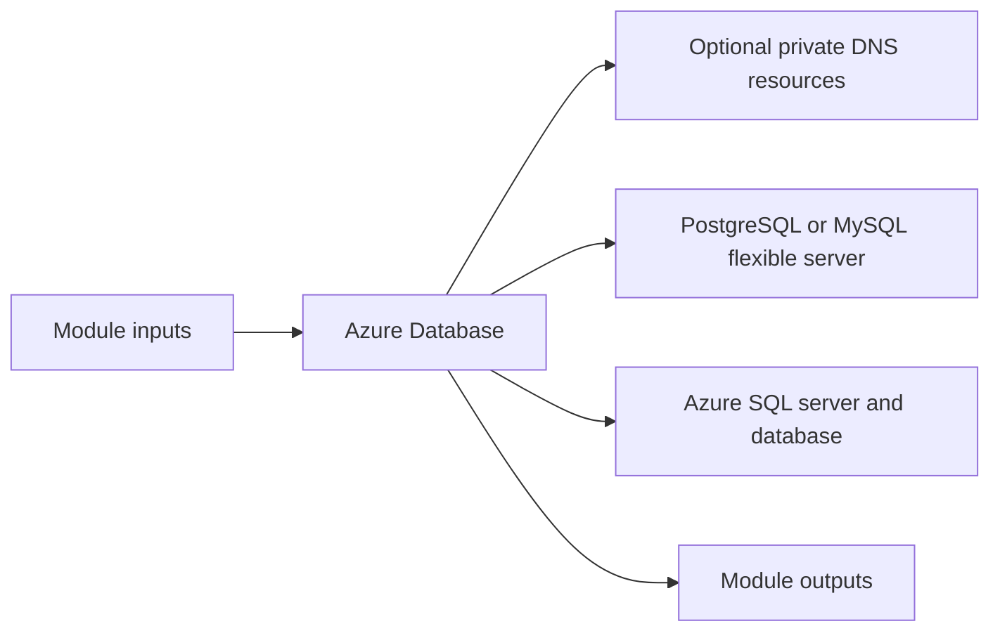

# Azure Database Module

Deploys Azure PostgreSQL Flexible Server, MySQL Flexible Server, or Azure SQL resources based on the selected engine.

## Architecture


## Usage
```hcl
module "database" {
  source = "../../../modules/azure/database"
  project                  = "terraform-multicloud"
  environment              = "dev"
  resource_group_name      = "rg-terraform-multicloud-dev"
  location                 = "eastus"
  subnet_id                = "/subscriptions/00000000-0000-0000-0000-000000000000/resourceGroups/rg-terraform-multicloud-dev/providers/Microsoft.Network/virtualNetworks/terraform-multicloud-dev-vnet/subnets/private"
  db_name                  = "appdb"
  admin_username           = "azureadmin"
  admin_password           = "ChangeMe123!"
  sku_name                 = "B_Standard_B1ms"
  tags                     = { ManagedBy = "terraform" }
}
```

## Inputs
| Name | Description | Type | Default | Required |
|---|---|---|---|---|
| `project` | Project name. | `string` | n/a | yes |
| `environment` | Deployment environment. | `string` | n/a | yes |
| `resource_group_name` | Azure resource group name. | `string` | n/a | yes |
| `location` | Azure region. | `string` | n/a | yes |
| `subnet_id` | Delegated subnet identifier for database resources when needed. | `string` | n/a | yes |
| `vnet_id` | VNet ID for private DNS zone link. Optional. | `string` | `""` | no |
| `engine` | Database engine: postgresql, mysql, sqlserver | `string` | `"postgresql"` | no |
| `db_name` | Database name. | `string` | n/a | yes |
| `admin_username` | Database administrator username. | `string` | n/a | yes |
| `admin_password` | Database administrator password. | `string` | n/a | yes |
| `sku_name` | Azure database SKU name. | `string` | n/a | yes |
| `storage_mb` | Allocated storage in MB. | `number` | `32768` | no |
| `postgresql_version` | PostgreSQL version. | `string` | `"14"` | no |
| `mysql_version` | MySQL Flexible Server version. | `string` | `"8.0.21"` | no |
| `mssql_sku` | Azure SQL Database SKU name. | `string` | `"Basic"` | no |
| `tags` | Common resource tags. | `map(string)` | `{}` | no |

## Outputs
| Name | Description |
|---|---|
| `db_fqdn` | DB FQDN exposed by the module. |
| `db_name` | DB Name exposed by the module. |
| `engine` | Engine exposed by the module. |

## Dependencies/Requirements
- Terraform `>= 1.5.0`
- Provider `azurerm` ~> 3.0
- Provider `random` ~> 3.6
- Requires database subnet and resource group outputs from `modules/azure/vnet`.
- Linking private DNS to the VNet requires the `vnet_id` input.
- Provide administrator credentials securely.
