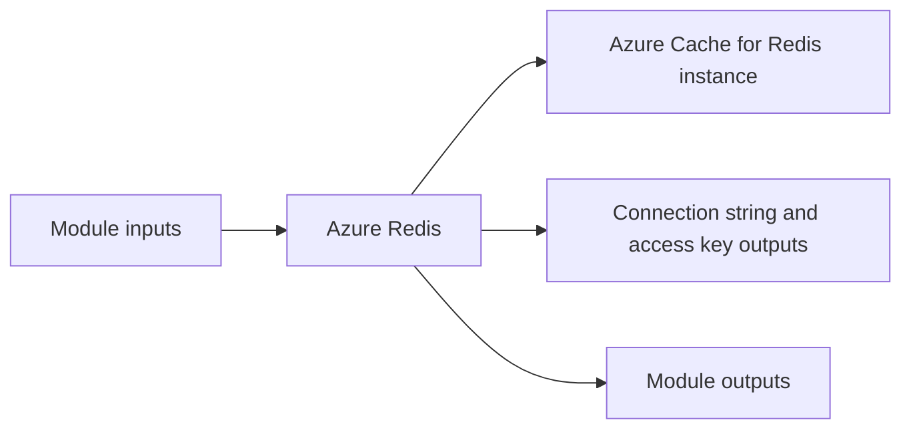

# Azure Redis Module

Creates an Azure Cache for Redis instance with configurable SKU, capacity, and memory policy settings.

## Architecture


## Usage
```hcl
module "redis" {
  source = "../../../modules/azure/redis"
  project                  = "terraform-multicloud"
  environment              = "dev"
  resource_group_name      = "rg-terraform-multicloud-dev"
  location                 = "eastus"
  tags                     = { ManagedBy = "terraform" }
}
```

## Inputs
| Name | Description | Type | Default | Required |
|---|---|---|---|---|
| `project` | Project. | `string` | n/a | yes |
| `environment` | Environment. | `string` | n/a | yes |
| `resource_group_name` | Resource Group Name. | `string` | n/a | yes |
| `location` | Location. | `string` | n/a | yes |
| `capacity` | Override Redis capacity (null = env default) | `number` | `null` | no |
| `family` | Override Redis family C or P (null = env default) | `string` | `null` | no |
| `sku_name` | Override SKU: Basic, Standard, Premium (null = env default) | `string` | `null` | no |
| `redis_version` | Redis major version (6 or 7) | `number` | `7` | no |
| `maxmemory_policy` | Maxmemory Policy. | `string` | `"allkeys-lru"` | no |
| `tags` | Tags. | `map(string)` | `{}` | no |

## Outputs
| Name | Description |
|---|---|
| `redis_hostname` | Redis Hostname exposed by the module. |
| `redis_port` | Redis Port exposed by the module. |
| `redis_primary_key` | Redis Primary Key exposed by the module. |
| `redis_connection_string` | Redis Connection String exposed by the module. |

## Dependencies/Requirements
- Terraform `>= 1.5.0`
- Provider `azurerm` ~> 3.0
- Requires an existing Azure resource group and location.
- Treat primary keys as secrets and store them securely.
