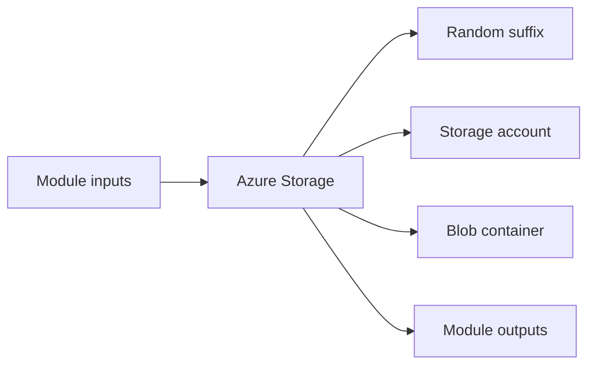

# Azure Storage Module

Creates an Azure Storage Account and Blob container for object storage workloads.

## Architecture


## Usage
```hcl
module "storage" {
  source = "../../../modules/azure/storage"
  project                  = "terraform-multicloud"
  environment              = "dev"
  resource_group_name      = "rg-terraform-multicloud-dev"
  location                 = "eastus"
  tags                     = { ManagedBy = "terraform" }
}
```

## Inputs
| Name | Description | Type | Default | Required |
|---|---|---|---|---|
| `project` | Project name. | `string` | n/a | yes |
| `environment` | Deployment environment. | `string` | n/a | yes |
| `resource_group_name` | Azure resource group name. | `string` | n/a | yes |
| `location` | Azure region. | `string` | n/a | yes |
| `account_tier` | Storage account tier. | `string` | `"Standard"` | no |
| `replication_type` | Storage replication type. | `string` | `"LRS"` | no |
| `tags` | Common resource tags. | `map(string)` | `{}` | no |

## Outputs
| Name | Description |
|---|---|
| `storage_account_id` | Azure Storage Account identifier. |
| `storage_account_name` | Azure Storage Account name. |
| `primary_blob_endpoint` | Primary blob endpoint. |
| `container_name` | Blob container name. |

## Dependencies/Requirements
- Terraform `>= 1.5.0`
- Provider `azurerm` ~> 3.0
- Provider `random` ~> 3.6
- Requires an existing Azure resource group and location.
- Storage account names must be globally unique and DNS-compliant.
