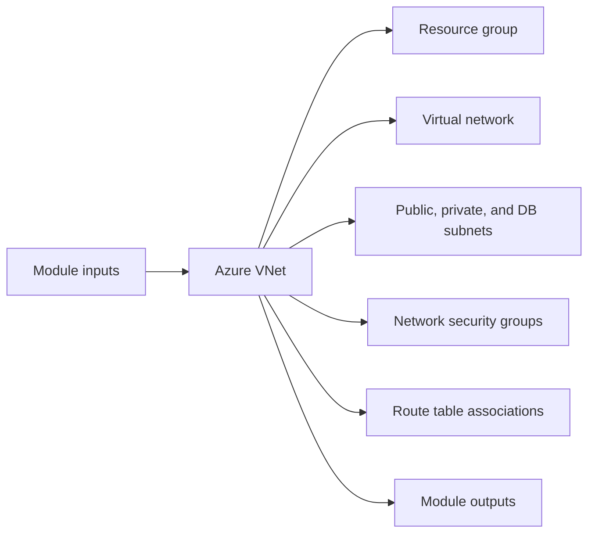

# Azure VNet Module

Builds the base Azure network with a resource group, VNet, public/private/database subnets, NSGs, and route table associations.

## Architecture


## Usage
```hcl
module "vnet" {
  source = "../../../modules/azure/vnet"
  project                  = "terraform-multicloud"
  environment              = "dev"
  location                 = "eastus"
  resource_group_name      = "rg-terraform-multicloud-dev"
  tags                     = { ManagedBy = "terraform" }
}
```

## Inputs
| Name | Description | Type | Default | Required |
|---|---|---|---|---|
| `project` | Project name. | `string` | n/a | yes |
| `environment` | Deployment environment. | `string` | n/a | yes |
| `location` | Azure region. | `string` | n/a | yes |
| `vnet_cidr` | CIDR block for the VNet. | `string` | `"10.0.0.0/16"` | no |
| `resource_group_name` | Resource group name. | `string` | n/a | yes |
| `tags` | Common resource tags. | `map(string)` | `{}` | no |

## Outputs
| Name | Description |
|---|---|
| `resource_group_name` | Azure resource group name. |
| `vnet_id` | Virtual network identifier. |
| `vnet_name` | Virtual network name. |
| `public_subnet_id` | Public subnet identifier. |
| `private_subnet_id` | Private subnet identifier. |
| `db_subnet_id` | Database subnet identifier. |

## Dependencies/Requirements
- Terraform `>= 1.5.0`
- Provider `azurerm` ~> 3.0
- This is the base networking module for the Azure stack.
- Downstream Azure modules typically consume its resource group, VNet, and subnet outputs.
