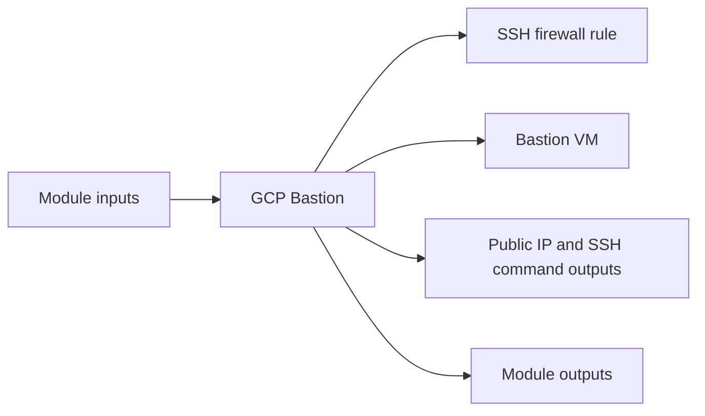

# GCP Bastion Module

Creates a bastion Compute Engine VM and an SSH firewall rule for administrative access.

## Architecture


## Usage
```hcl
module "bastion" {
  source = "../../../modules/gcp/bastion"
  project_id               = "my-gcp-project"
  project                  = "terraform-multicloud"
  environment              = "dev"
  zone                     = "us-central1-a"
  network_self_link        = "projects/my-gcp-project/global/networks/terraform-multicloud-dev"
  public_key               = file("~/.ssh/id_rsa.pub")
  tags                     = { managed_by = "terraform" }
}
```

## Inputs
| Name | Description | Type | Default | Required |
|---|---|---|---|---|
| `project_id` | GCP project identifier. | `string` | n/a | yes |
| `project` | Project name prefix. | `string` | n/a | yes |
| `environment` | Deployment environment. | `string` | n/a | yes |
| `zone` | GCP zone for the bastion host. | `string` | n/a | yes |
| `network_self_link` | VPC network self link. | `string` | n/a | yes |
| `public_key` | SSH public key for bastion access. | `string` | n/a | yes |
| `allowed_ssh_cidrs` | CIDR blocks allowed to SSH to the bastion host. | `list(string)` | `["0.0.0.0/0"]` | no |
| `tags` | GCP labels. | `map(string)` | `{}` | no |

## Outputs
| Name | Description |
|---|---|
| `bastion_public_ip` | Bastion Public IP exposed by the module. |
| `instance_name` | Instance Name exposed by the module. |
| `ssh_command` | SSH Command exposed by the module. |

## Dependencies/Requirements
- Terraform `>= 1.5.0`
- Provider `google` ~> 5.0
- Requires network outputs from `modules/gcp/vpc`.
- Requires an SSH public key for OS Login metadata.
