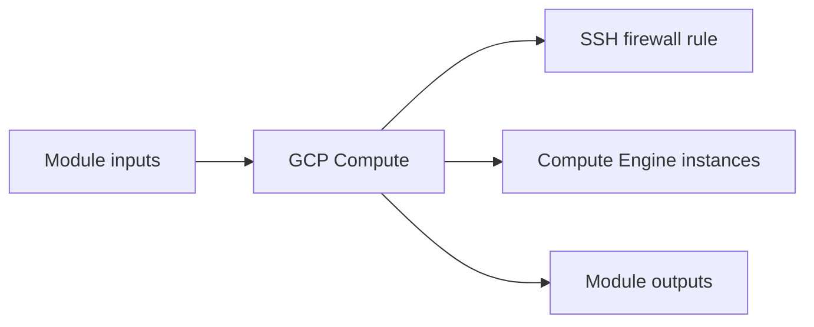

# GCP Compute Module

Deploys Compute Engine virtual machines behind a scoped SSH firewall rule inside the target subnet.

## Architecture


## Usage
```hcl
module "compute" {
  source = "../../../modules/gcp/compute"
  project_id               = "my-gcp-project"
  project                  = "terraform-multicloud"
  environment              = "dev"
  region                   = "us-central1"
  zone                     = "us-central1-a"
  network_self_link        = "projects/my-gcp-project/global/networks/terraform-multicloud-dev"
  subnetwork_id            = "projects/my-gcp-project/regions/us-central1/subnetworks/private"
  machine_type             = "e2-medium"
  tags                     = { managed_by = "terraform" }
}
```

## Inputs
| Name | Description | Type | Default | Required |
|---|---|---|---|---|
| `project_id` | GCP project identifier. | `string` | n/a | yes |
| `project` | Project name prefix. | `string` | n/a | yes |
| `environment` | Deployment environment. | `string` | n/a | yes |
| `region` | GCP region. | `string` | n/a | yes |
| `zone` | GCP zone. | `string` | n/a | yes |
| `network_self_link` | Network self link. | `string` | n/a | yes |
| `subnetwork_id` | Subnetwork identifier or self link. | `string` | n/a | yes |
| `vm_count` | Number of virtual machines to create. | `number` | `2` | no |
| `machine_type` | GCP machine type. | `string` | n/a | yes |
| `disk_size_gb` | Boot disk size in GB. | `number` | `30` | no |
| `image` | Boot image. | `string` | `""` | no |
| `image_os` | Boot image OS selection. | `string` | `"ubuntu"` | no |
| `tags` | GCP labels. | `map(string)` | `{}` | no |

## Outputs
| Name | Description |
|---|---|
| `instance_names` | GCP instance names. |
| `instance_ids` | GCP instance identifiers. |
| `self_links` | GCP instance self links. |
| `private_ips` | Private IP addresses of the GCP instances. |
| `zones` | Zones where the instances are deployed. |

## Dependencies/Requirements
- Terraform `>= 1.5.0`
- Provider `google` ~> 5.0
- Requires network and subnet outputs from `modules/gcp/vpc`.
- Supports multiple VM instances via `vm_count`.
