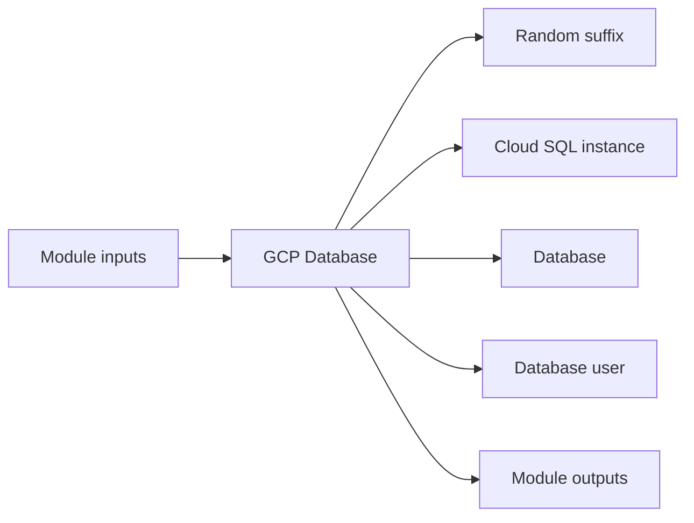

# GCP Database Module

Creates a Cloud SQL instance, database, and user with optional private network connectivity.

## Architecture


## Usage
```hcl
module "database" {
  source = "../../../modules/gcp/database"
  project_id               = "my-gcp-project"
  project                  = "terraform-multicloud"
  environment              = "dev"
  region                   = "us-central1"
  db_name                  = "appdb"
  db_user                  = "appadmin"
  db_password              = "change-me-securely"
  private_network_id       = "projects/my-gcp-project/global/networks/terraform-multicloud-dev"
  tags                     = { managed_by = "terraform" }
}
```

## Inputs
| Name | Description | Type | Default | Required |
|---|---|---|---|---|
| `project_id` | GCP project identifier. | `string` | n/a | yes |
| `project` | Project name prefix. | `string` | n/a | yes |
| `environment` | Deployment environment. | `string` | n/a | yes |
| `region` | GCP region. | `string` | n/a | yes |
| `engine` | Database engine: postgresql, mysql, sqlserver | `string` | `"postgresql"` | no |
| `db_name` | Cloud SQL database name. | `string` | n/a | yes |
| `db_user` | Cloud SQL user name. | `string` | n/a | yes |
| `db_password` | Cloud SQL user password. | `string` | n/a | yes |
| `tier` | Cloud SQL machine tier. | `string` | `"db-f1-micro"` | no |
| `database_version` | Optional Cloud SQL version override. | `string` | `null` | no |
| `disk_size` | Cloud SQL disk size in GB. | `number` | `20` | no |
| `private_network_id` | Private VPC network self link for Cloud SQL private service access. | `string` | n/a | yes |
| `tags` | Cloud SQL labels. | `map(string)` | `{}` | no |

## Outputs
| Name | Description |
|---|---|
| `db_connection_name` | Cloud SQL connection name. |
| `db_public_ip` | Cloud SQL public IP address. |
| `db_private_ip` | Cloud SQL private IP address. |
| `db_name` | Cloud SQL database name. |
| `engine` | Configured Cloud SQL engine. |

## Dependencies/Requirements
- Terraform `>= 1.5.0`
- Provider `google` ~> 5.0
- Provider `random` ~> 3.6
- Requires a project, region, and optionally a private VPC network from `modules/gcp/vpc`.
- Provide database credentials securely.
