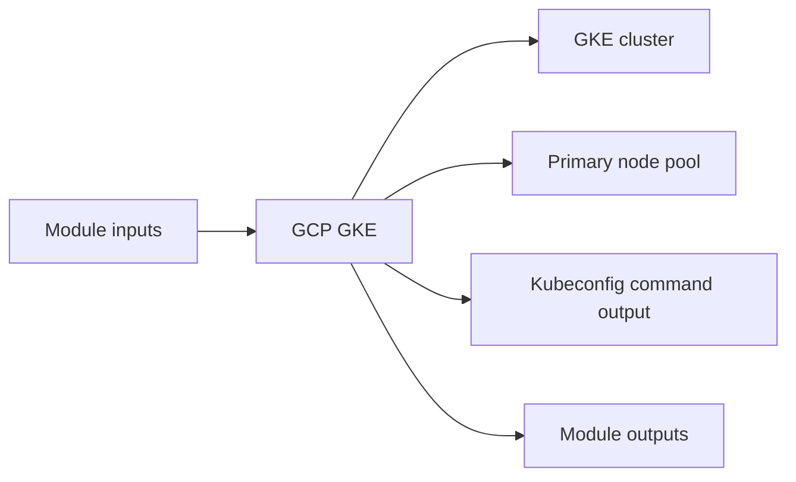

# GCP GKE Module

Creates a private GKE cluster and node pool with configurable release channel, scaling, and IP ranges.

## Architecture


## Usage
```hcl
module "gke" {
  source = "../../../modules/gcp/gke"
  project_id               = "my-gcp-project"
  project                  = "terraform-multicloud"
  environment              = "dev"
  region                   = "us-central1"
  network_self_link        = "projects/my-gcp-project/global/networks/terraform-multicloud-dev"
  subnetwork_self_link     = "projects/my-gcp-project/regions/us-central1/subnetworks/private"
  tags                     = { managed_by = "terraform" }
}
```

## Inputs
| Name | Description | Type | Default | Required |
|---|---|---|---|---|
| `project_id` | GCP project identifier. | `string` | n/a | yes |
| `project` | Project name prefix. | `string` | n/a | yes |
| `environment` | Deployment environment. | `string` | n/a | yes |
| `region` | GCP region for the GKE cluster. | `string` | n/a | yes |
| `network_self_link` | VPC network self link. | `string` | n/a | yes |
| `subnetwork_self_link` | Subnetwork self link for the GKE cluster. | `string` | n/a | yes |
| `kubernetes_version` | Minimum Kubernetes control plane version. | `string` | `"1.29"` | no |
| `machine_type` | GKE node machine type. | `string` | `"e2-medium"` | no |
| `node_count` | Desired node count. | `number` | `2` | no |
| `node_min_count` | Minimum node count. | `number` | `1` | no |
| `node_max_count` | Maximum node count. | `number` | `10` | no |
| `node_disk_size` | Worker node disk size in GB. | `number` | `50` | no |
| `release_channel` | GKE release channel. | `string` | `"REGULAR"` | no |
| `cluster_ipv4_cidr` | CIDR block for GKE pods. | `string` | `"172.20.0.0/16"` | no |
| `services_ipv4_cidr` | CIDR block for GKE services. | `string` | `"172.21.0.0/22"` | no |
| `master_ipv4_cidr_block` | CIDR block for the private GKE control plane. | `string` | `"172.16.0.0/28"` | no |
| `tags` | GCP labels. | `map(string)` | `{}` | no |

## Outputs
| Name | Description |
|---|---|
| `cluster_name` | Cluster Name exposed by the module. |
| `cluster_endpoint` | Cluster Endpoint exposed by the module. |
| `cluster_ca_certificate` | Cluster CA Certificate exposed by the module. |
| `kubeconfig_command` | Kubeconfig Command exposed by the module. |

## Dependencies/Requirements
- Terraform `>= 1.5.0`
- Provider `google` ~> 5.0
- Requires network and subnet outputs from `modules/gcp/vpc`.
- Cluster, service, and master CIDR ranges must not overlap existing networks.
