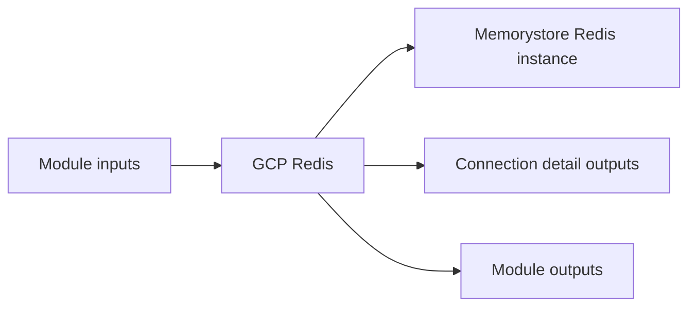

# GCP Redis Module

Creates a Memorystore for Redis instance connected to the selected VPC network.

## Architecture


## Usage
```hcl
module "redis" {
  source = "../../../modules/gcp/redis"
  project_id               = "my-gcp-project"
  project                  = "terraform-multicloud"
  environment              = "dev"
  region                   = "us-central1"
  network_self_link        = "projects/my-gcp-project/global/networks/terraform-multicloud-dev"
  tags                     = { managed_by = "terraform" }
}
```

## Inputs
| Name | Description | Type | Default | Required |
|---|---|---|---|---|
| `project_id` | Project ID. | `string` | n/a | yes |
| `project` | Project. | `string` | n/a | yes |
| `environment` | Environment. | `string` | n/a | yes |
| `region` | Region. | `string` | n/a | yes |
| `zone` | Zone. | `string` | `""` | no |
| `network_self_link` | Network Self Link. | `string` | n/a | yes |
| `memory_size_gb` | Memory Size Gb. | `number` | `1` | no |
| `redis_version` | Redis Version. | `string` | `"REDIS_7_0"` | no |
| `maxmemory_policy` | Maxmemory Policy. | `string` | `"allkeys-lru"` | no |
| `tags` | Tags. | `map(string)` | `{}` | no |

## Outputs
| Name | Description |
|---|---|
| `redis_host` | Redis Host exposed by the module. |
| `redis_port` | Redis Port exposed by the module. |
| `redis_auth_string` | Redis Auth String exposed by the module. |
| `redis_connection` | Redis connection in host:port format. |

## Dependencies/Requirements
- Terraform `>= 1.5.0`
- Provider `google` ~> 5.0
- Requires network outputs from `modules/gcp/vpc`.
- Treat the auth string as a secret if auth is enabled in the target configuration.
