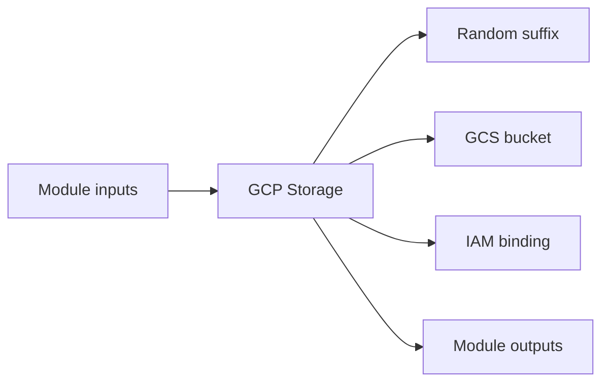

# GCP Storage Module

Creates a GCS bucket with a unique suffix and applies IAM bindings for storage access.

## Architecture


## Usage
```hcl
module "storage" {
  source = "../../../modules/gcp/storage"
  project_id               = "my-gcp-project"
  project                  = "terraform-multicloud"
  environment              = "dev"
  region                   = "us-central1"
  bucket_name_suffix       = "shared"
  tags                     = { managed_by = "terraform" }
}
```

## Inputs
| Name | Description | Type | Default | Required |
|---|---|---|---|---|
| `project_id` | GCP project identifier. | `string` | n/a | yes |
| `project` | Project name prefix. | `string` | n/a | yes |
| `environment` | Deployment environment. | `string` | n/a | yes |
| `region` | GCP region. | `string` | n/a | yes |
| `bucket_name_suffix` | Suffix used for the GCS bucket name. | `string` | n/a | yes |
| `storage_class` | GCS storage class. | `string` | `"STANDARD"` | no |
| `tags` | GCS labels. | `map(string)` | `{}` | no |

## Outputs
| Name | Description |
|---|---|
| `bucket_name` | GCS bucket name. |
| `bucket_url` | GCS bucket URL. |
| `bucket_self_link` | GCS bucket self link. |

## Dependencies/Requirements
- Terraform `>= 1.5.0`
- Provider `google` ~> 5.0
- Provider `random` ~> 3.6
- Requires a GCP project and region.
- Bucket names must be globally unique.
