# GCP VPC Module

Builds the GCP network foundation with custom subnets, firewall rules, Cloud Router, and Cloud NAT.

## Architecture

```mermaid
flowchart LR
  inputs["Module inputs"] --> module["GCP VPC"]
  module --> c1["VPC network"]
  module --> c2["Public, private, and DB subnets"]
  module --> c3["Cloud Router and NAT"]
  module --> c4["Custom routes"]
  module --> c5["Firewall rules"]
  module --> outputs["Module outputs"]
```


## Usage
```hcl
module "vpc" {
  source = "../../../modules/gcp/vpc"
  project_id               = "my-gcp-project"
  project                  = "terraform-multicloud"
  environment              = "dev"
  region                   = "us-central1"
  public_subnet_cidr       = "10.0.1.0/24"
  private_subnet_cidr      = "10.0.10.0/24"
  db_subnet_cidr           = "10.0.20.0/24"
  tags                     = { managed_by = "terraform" }
}
```

## Inputs
| Name | Description | Type | Default | Required |
|---|---|---|---|---|
| `project_id` | GCP project identifier. | `string` | n/a | yes |
| `project` | Project name prefix. | `string` | n/a | yes |
| `environment` | Deployment environment. | `string` | n/a | yes |
| `region` | GCP region. | `string` | n/a | yes |
| `vpc_cidr` | VPC CIDR range. | `string` | `"10.0.0.0/16"` | no |
| `public_subnet_cidr` | Public subnet CIDR range. | `string` | n/a | yes |
| `private_subnet_cidr` | Private subnet CIDR range. | `string` | n/a | yes |
| `db_subnet_cidr` | Database subnet CIDR range. | `string` | n/a | yes |
| `tags` | Labels applied to GCP resources. | `map(string)` | `{}` | no |

## Outputs
| Name | Description |
|---|---|
| `network_id` | VPC network identifier. |
| `network_name` | VPC network name. |
| `public_subnet_id` | Public subnetwork identifier. |
| `private_subnet_id` | Private subnetwork identifier. |
| `private_subnet_self_link` | Private subnetwork self link (for GKE). |
| `db_subnet_id` | Database subnetwork identifier. |
| `network_self_link` | VPC self link. |

## Dependencies/Requirements
- Terraform `>= 1.5.0`
- Provider `google` ~> 5.0
- This is the base networking module for the GCP stack.
- Downstream GCP modules typically consume its network and subnet outputs.
